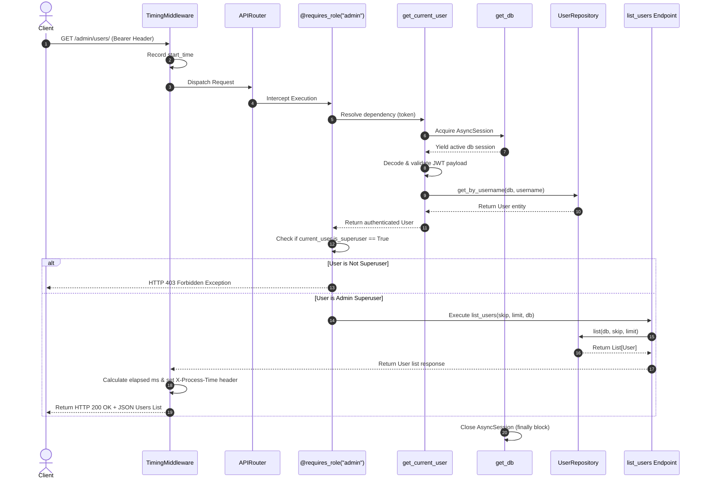

# Exercise 6: Part 2 - Request Execution Flow Trace (`/admin/users/`)

## Request Sequence Diagram

---

## Step-by-Step Execution Narrative

1. **HTTP Request Entry:** Client issues `GET /admin/users/` with Authorization Header (`Bearer <token>`).
2. **Middleware Interception:** `TimingMiddleware` intercepts the request and records `start_time = datetime.utcnow()`.
3. **Route & Decorator Matching:** Router selects `list_users` and encounters `@requires_role("admin")`.
4. **Dependency Resolution (`get_db`):** Opens an async database session via `get_db()` context manager.
5. **Authentication Resolution (`get_current_user`):** Decodes JWT token, extracts `sub` username, queries `UserRepository`, and retrieves the user object.
6. **Authorization Check:** `@requires_role` verifies `current_user.is_superuser`. If false, raises HTTP 403.
7. **Endpoint Logic Execution:** `list_users` queries `UserRepository.list()` to fetch user records.
8. **Response Processing & Header Enrichment:** `TimingMiddleware` calculates total elapsed execution time in milliseconds and attaches header `X-Process-Time`.
9. **Session Cleanup:** `get_db` closes the database session in its `finally` block.
